  

  

## 📌 About Me
- I’m Sravan Kumar, an AI & Full-Stack Developer focused on building intelligent, scalable systems. My work spans AI, Web Development, and Automation, with hands-on experience in Python applications, Computer Vision, and Robotics.
- I focus on building real, production-ready projects—combining strong backend systems with practical AI integration and clean user experiences. I approach development with a product-first mindset, prioritizing performance, usability, and scalability.

## 🧠 My Focus Areas
- AI & Machine Learning
- Full-Stack Product Development
- Web Development
- Computer Vision & Intelligent Automation

## 📊 GitHub Stats & Trophies

  

  

  

## 🛠️ Languages & Tools

<h3 align="center">Programming Languages</h3>

  &nbsp;&nbsp;&nbsp;&nbsp;
  &nbsp;&nbsp;&nbsp;&nbsp;
  &nbsp;&nbsp;&nbsp;&nbsp;
  

<h3 align="center">Frontend</h3>

  &nbsp;&nbsp;&nbsp;&nbsp;
  &nbsp;&nbsp;&nbsp;&nbsp;
  &nbsp;&nbsp;&nbsp;&nbsp;
  &nbsp;&nbsp;&nbsp;&nbsp;
  &nbsp;&nbsp;&nbsp;&nbsp;
  

<h3 align="center">Database</h3>

  &nbsp;&nbsp;&nbsp;&nbsp;
  &nbsp;&nbsp;&nbsp;&nbsp;
  

<h3 align="center">Tools</h3>

  &nbsp;&nbsp;&nbsp;&nbsp;
  &nbsp;&nbsp;&nbsp;&nbsp;
  

## 🔗 Connect with Me

  &nbsp;&nbsp;&nbsp;
  &nbsp;&nbsp;&nbsp;
  &nbsp;&nbsp;&nbsp;
  

  

